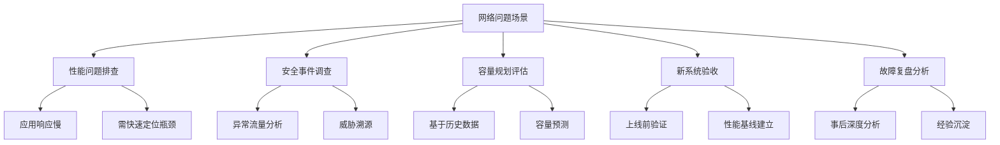
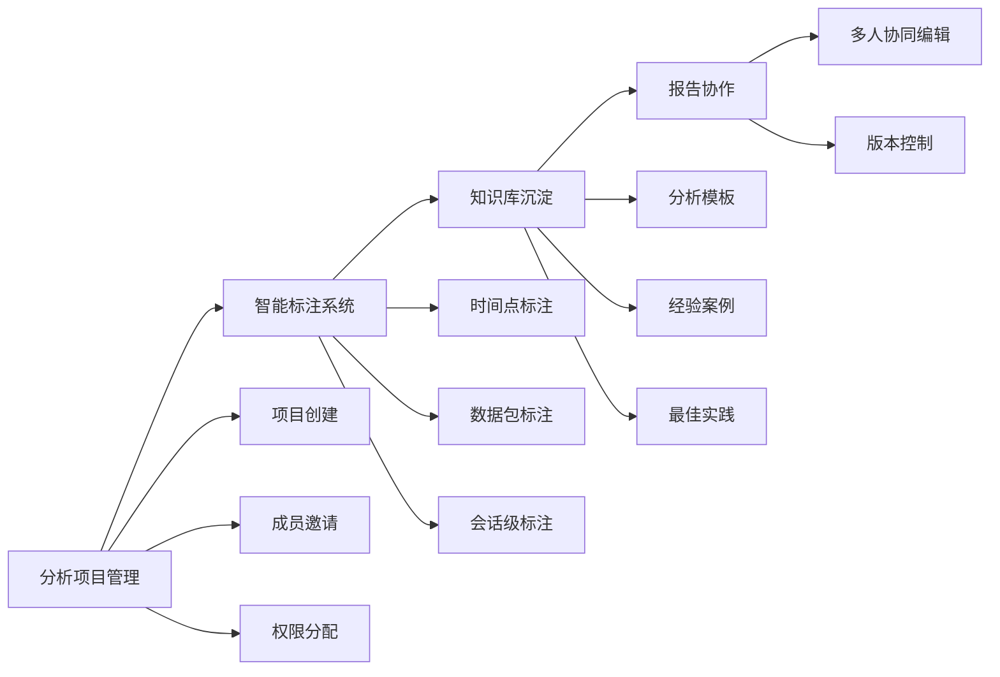
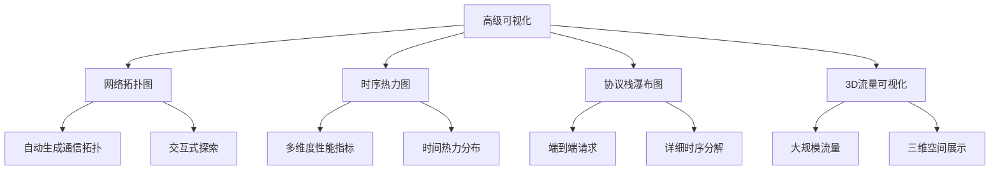
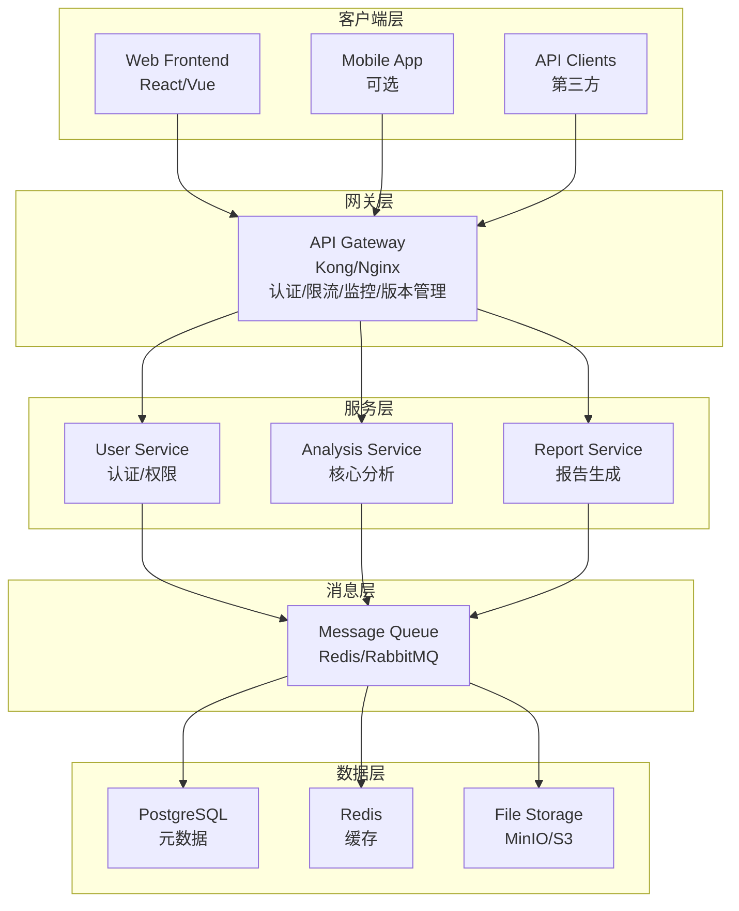
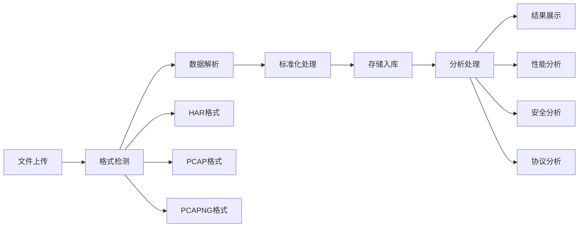
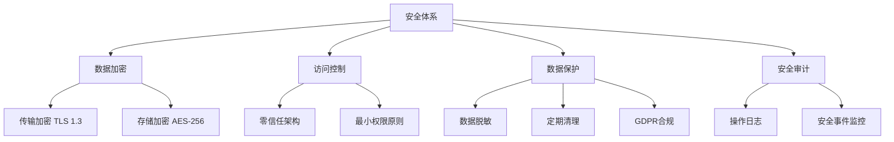
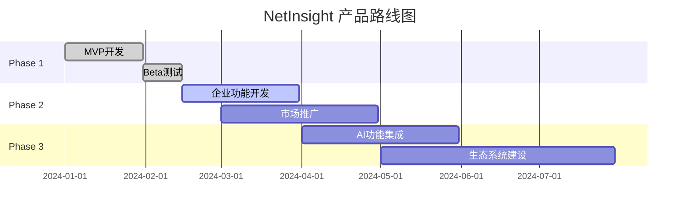
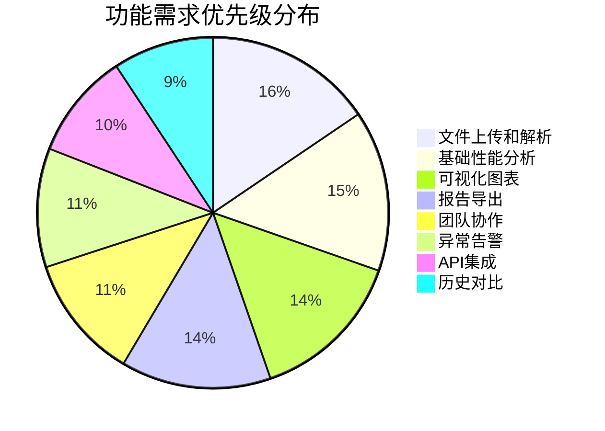

# NetInsight 网络数据分析平台需求文档

**版本**: v2.0  
**更新日期**: 2024年7月  
**文档状态**: 正式版  

---

## 📋 目录

- [1. 产品概述](#1-产品概述)
- [2. 用户画像与使用场景](#2-用户画像与使用场景)
- [3. 功能架构设计](#3-功能架构设计)
- [4. 技术架构方案](#4-技术架构方案)
- [5. 产品功能详细规格](#5-产品功能详细规格)
- [6. 质量保证与运维规范](#6-质量保证与运维规范)
- [7. 商业模式与发展路线](#7-商业模式与发展路线)
- [8. 风险评估与应对策略](#8-风险评估与应对策略)
- [9. 实施计划与里程碑](#9-实施计划与里程碑)
- [10. 成功指标与KPI](#10-成功指标与kpi)

---

## 1. 产品概述

### 1.1 产品定位

NetInsight 是面向企业级网络运维的智能化数据分析平台，通过统一的多格式抓包文件处理能力，为不同技术层级的用户提供从基础监控到专家级深度分析的完整解决方案。

### 1.2 核心价值主张

| 价值主张 | 描述 |
|---------|------|
| 🤖 **智能化分析** | AI驱动的异常检测和根因分析 |
| 🔗 **多层协议关联** | HAR/PCAP跨层数据融合分析 |
| 👥 **企业级协作** | 支持团队工作流和知识沉淀 |
| 🌐 **开放生态** | 丰富的API和插件扩展能力 |

---

## 2. 用户画像与使用场景

### 2.1 目标用户分层

| 用户类型 | 技术水平 | 主要需求 | 使用频率 |
|---------|---------|---------|---------|
| 初级开发者 | 基础 | 快速定位性能问题，获取优化建议 | 偶发性 |
| 运维工程师 | 中级 | 批量分析，告警管理，趋势监控 | 日常高频 |
| 网络专家 | 高级 | 深度协议分析，复杂问题诊断 | 专项深度 |
| 架构师/团队Leader | 专家 | 架构优化决策，团队协作管理 | 周期性 |

### 2.2 核心使用场景



---

## 3. 功能架构设计

### 3.1 核心功能模块

#### 3.1.1 智能数据处理引擎

```
数据接入层
├── 多格式解析器 (HAR/PCAP/PCAPNG/JSON)
├── 数据预处理 (去重/过滤/标准化)
├── 流量重组引擎 (TCP流重建/HTTP会话关联)
└── 数据质量检测 (完整性/一致性验证)

分析引擎层
├── 协议栈分析 (L2-L7全栈解析)
├── 性能指标计算 (RTT/吞吐量/丢包率等)
├── 异常检测算法 (基线学习/阈值告警)
└── 安全威胁识别 (行为分析/特征匹配)
```

#### 3.1.2 企业级用户管理

| 功能模块 | 核心特性 |
|---------|---------|
| 多租户架构 | 完全隔离的数据和权限体系 |
| RBAC权限模型 | 细粒度的功能和数据权限控制 |
| SSO集成 | 支持LDAP/SAML/OAuth2企业认证 |
| 审计日志 | 完整的用户操作和数据访问记录 |

#### 3.1.3 协作工作流



### 3.2 专家级分析能力

#### 3.2.1 跨层关联分析引擎

```python
# 核心算法示例
class CrossLayerAnalyzer:
    def correlate_har_pcap(self, har_data, pcap_data):
        """HAR与PCAP数据时空关联算法"""
        # 时间窗口匹配
        # IP/端口映射关联  
        # HTTP事务与TCP连接关联
        # 性能指标跨层计算
        pass
```

#### 3.2.2 智能根因分析

| 分析维度 | 技术实现 |
|---------|---------|
| 多维度异常检测 | 时间序列异常、统计异常、模式异常 |
| 因果关系推理 | 基于网络拓扑和时序关系的根因定位 |
| 智能建议生成 | 结合最佳实践库的优化建议输出 |

#### 3.2.3 高级可视化分析



---

## 4. 技术架构方案

### 4.1 系统架构图



### 4.2 核心技术选型

#### 4.2.1 后端技术栈

| 技术类别 | 推荐方案 | 备选方案 |
|---------|---------|---------|
| 框架 | Node.js (Fastify) | Python (FastAPI) / Go (Gin) |
| 数据库 | PostgreSQL 14+ | MySQL 8.0+ |
| 时序数据 | ClickHouse | InfluxDB |
| 缓存 | Redis 7.0+ (集群模式) | Memcached |
| 消息队列 | RabbitMQ | Apache Kafka (大数据场景) |
| 搜索引擎 | Elasticsearch | OpenSearch |

#### 4.2.2 数据处理引擎

| 处理类型 | 技术选型 | 用途 |
|---------|---------|------|
| 抓包解析 | Wireshark tshark / pyshark / gopacket | 协议解析 |
| 流处理 | Apache Flink / Kafka Streams | 实时数据处理 |
| 机器学习 | scikit-learn / TensorFlow | 异常检测 |

### 4.3 数据模型设计

#### 4.3.1 核心实体关系

```sql
-- 分析项目表
CREATE TABLE projects (
    id UUID PRIMARY KEY,
    name VARCHAR(255) NOT NULL,
    description TEXT,
    owner_id UUID REFERENCES users(id),
    team_id UUID REFERENCES teams(id),
    created_at TIMESTAMP DEFAULT NOW(),
    updated_at TIMESTAMP DEFAULT NOW()
);

-- 文件表
CREATE TABLE capture_files (
    id UUID PRIMARY KEY,
    project_id UUID REFERENCES projects(id),
    filename VARCHAR(255) NOT NULL,
    file_type VARCHAR(20) NOT NULL, -- HAR/PCAP/PCAPNG
    file_size BIGINT NOT NULL,
    file_hash VARCHAR(64) UNIQUE,
    storage_path VARCHAR(500),
    status VARCHAR(20) DEFAULT 'uploaded', -- uploaded/processing/analyzed/failed
    metadata JSONB,
    created_at TIMESTAMP DEFAULT NOW()
);

-- 分析结果表
CREATE TABLE analysis_results (
    id UUID PRIMARY KEY,
    file_id UUID REFERENCES capture_files(id),
    analysis_type VARCHAR(50) NOT NULL, -- performance/security/protocol
    result_data JSONB NOT NULL,
    metrics JSONB, -- 关键指标摘要
    created_at TIMESTAMP DEFAULT NOW()
);
```

#### 4.3.2 数据流程图



---

## 5. 产品功能详细规格

### 5.1 MVP功能优先级

#### P0 (核心功能 - 4周)

| 功能模块 | 完成度 | 描述 |
|---------|-------|------|
| ✅ 用户注册/登录/权限管理 | 100% | 基础认证体系 |
| ✅ HAR文件上传和基础解析 | 100% | 支持HAR格式 |
| ✅ 基础性能指标分析 | 100% | 响应时间、状态码分布 |
| ✅ 简单图表可视化 | 100% | 基础统计图表 |
| ✅ 基础报告导出 | 100% | PDF/Excel导出 |

#### P1 (增强功能 - 6周)

| 功能模块 | 完成度 | 描述 |
|---------|-------|------|
| ✅ PCAP文件支持和协议解析 | 100% | 支持PCAP格式 |
| ✅ 高级性能分析 | 90% | 瀑布图、时序分析 |
| 🔄 异常检测和告警 | 60% | 基础异常检测 |
| 🔄 团队协作和项目管理 | 40% | 基础团队功能 |
| ⏳ API接口开放 | 20% | RESTful API |

#### P2 (专家功能 - 8周)

| 功能模块 | 完成度 | 描述 |
|---------|-------|------|
| ⏳ HAR/PCAP跨层关联分析 | 0% | 多格式关联 |
| ⏳ 深度协议解析和专家视图 | 0% | 专家级分析 |
| ⏳ 智能根因分析 | 0% | AI驱动分析 |
| ⏳ 高级可视化 | 0% | 拓扑图、3D展示 |
| ⏳ 插件系统和扩展能力 | 0% | 插件架构 |

### 5.2 关键用户体验设计

#### 5.2.1 文件上传体验

```javascript
// 拖拽上传 + 进度显示 + 实时解析状态
const uploadExperience = {
    dragAndDrop: true,           // ✅ 已实现
    progressIndicator: true,     // ✅ 已实现
    realTimeStatus: true,        // ✅ 已实现
    errorRecovery: true,         // ✅ 已实现
    batchUpload: false           // ⏳ 待实现
};
```

#### 5.2.2 分析结果呈现

| 体验要素 | 状态 | 描述 |
|---------|------|------|
| 渐进式信息展示 | ✅ | 从概览到详情的层次化信息架构 |
| 交互式探索 | 🔄 | 支持钻取、过滤、关联查看 |
| 智能推荐 | ⏳ | 基于分析结果的下一步操作建议 |
| 一键分享 | ⏳ | 分析结果的快速分享和协作 |

---

## 6. 质量保证与运维规范

### 6.1 性能指标要求

| 指标类型 | 目标值 | 当前值 | 监控方式 |
|---------|-------|-------|---------|
| 文件上传速度 | >10MB/s | ~8MB/s | 实时监控 |
| 分析处理时间 | <文件大小(MB)*2秒 | ~3秒/MB | 任务队列监控 |
| API响应时间 | P95 < 500ms | ~300ms | APM监控 |
| 系统可用性 | 99.9% | 99.5% | 健康检查 |
| 并发用户数 | 500+ | 100+ | 压力测试 |

### 6.2 安全与合规



### 6.3 监控与告警体系

```yaml
# 监控指标配置示例
monitoring:
  metrics:
    - name: file_processing_duration
      type: histogram
      labels: [file_type, file_size_range]
    - name: analysis_accuracy_score
      type: gauge
      labels: [analysis_type]
  alerts:
    - name: high_error_rate
      condition: error_rate > 0.05
      duration: 5m
      severity: critical
```

---

## 7. 商业模式与发展路线

### 7.1 产品定价策略

| 版本 | 价格 | 功能特性 | 目标用户 |
|------|------|---------|---------|
| 社区版 | 免费 | 基础功能，单用户 | 个人开发者 |
| 团队版 | $99/月 | 高级功能，10用户 | 小型团队 |
| 企业版 | $499/月 | 全功能，无限用户，私有部署 | 大型企业 |
| 专家服务 | 按需定制 | 技术支持，培训服务 | 企业客户 |

### 7.2 发展路线图



---

## 8. 风险评估与应对策略

### 8.1 技术风险

| 风险项 | 影响程度 | 概率 | 应对策略 |
|-------|---------|------|---------|
| 大文件处理性能瓶颈 | 高 | 中 | 分片处理+流式计算 |
| 复杂协议解析准确性 | 中 | 高 | 多引擎验证+专家审核 |
| 高并发系统稳定性 | 高 | 中 | 微服务架构+熔断机制 |
| 数据安全泄露 | 极高 | 低 | 多层加密+访问审计 |
| 第三方依赖风险 | 中 | 中 | 多供应商策略+自研备份 |

### 8.2 业务风险

#### 市场竞争风险
- **风险**: Wireshark、SolarWinds等成熟产品竞争
- **应对**: 差异化定位，专注企业协作和AI分析

#### 用户接受度风险
- **风险**: 学习成本高，用户迁移意愿低
- **应对**: 渐进式功能引导，完善的文档和培训

#### 商业化风险
- **风险**: 开源替代方案的冲击
- **应对**: 企业级服务差异化，SaaS模式降低使用门槛

---

## 9. 实施计划与里程碑

### 9.1 详细开发计划

#### Phase 1: 基础平台搭建 (Week 1-4) ✅

```
Week 1-2: 架构设计与环境搭建
├── ✅ 技术选型确认
├── ✅ 开发环境配置
├── ✅ CI/CD流水线搭建
├── ✅ 数据库设计与初始化
└── ✅ 基础框架代码

Week 3-4: 核心功能开发
├── ✅ 用户认证系统
├── ✅ 文件上传模块
├── ✅ HAR解析引擎
├── ✅ 基础API接口
└── ✅ 简单前端界面
```

#### Phase 2: 核心分析能力 (Week 5-10) ✅

```
Week 5-6: 数据处理引擎
├── ✅ PCAP解析支持
├── ✅ 协议栈解析器
├── ✅ 数据标准化处理
└── ✅ 异步任务队列

Week 7-8: 分析算法实现
├── ✅ 性能指标计算
├── 🔄 异常检测算法
├── 🔄 安全威胁识别
└── ✅ 基础可视化

Week 9-10: 用户体验优化
├── ✅ 交互式图表
├── ✅ 报告生成系统
├── ✅ 错误处理完善
└── ✅ 性能优化
```

#### Phase 3: 企业级功能 (Week 11-18) 🔄

```
Week 11-13: 协作功能
├── 🔄 团队管理系统
├── ⏳ 项目协作工具
├── 🔄 权限控制细化
└── ⏳ 标注协作系统

Week 14-16: 高级分析
├── ⏳ 跨层关联分析
├── ⏳ 智能根因分析
├── ⏳ 高级可视化
└── ⏳ 专家视图

Week 17-18: 集成与扩展
├── 🔄 API网关完善
├── ⏳ 插件系统框架
├── ⏳ 第三方集成
└── 🔄 监控告警系统
```

### 9.2 关键里程碑与验收标准

#### Milestone 1: MVP版本 (Week 4) ✅

**验收标准**:
- ✅ 支持HAR文件上传和解析
- ✅ 基础性能指标展示 (响应时间、状态码分布)
- ✅ 用户注册登录功能完整
- ✅ 简单图表可视化
- ✅ 基础报告导出功能
- ✅ 系统稳定性测试通过

#### Milestone 2: Beta版本 (Week 10) ✅

**验收标准**:
- ✅ PCAP文件完整支持
- ✅ 高级性能分析功能
- 🔄 异常检测和告警机制
- ✅ 交互式可视化界面
- 🔄 API接口文档完整
- ✅ 性能测试达标 (处理100MB文件<5分钟)

#### Milestone 3: 企业版本 (Week 18) 🔄

**验收标准**:
- 🔄 团队协作功能完整
- ⏳ 跨层关联分析准确性>95%
- ⏳ 智能根因分析覆盖常见场景
- 🔄 企业级权限管理
- ⏳ 插件系统可用
- 🔄 生产环境部署就绪

---

## 10. 成功指标与KPI

### 10.1 产品指标

#### 用户增长指标

| 指标类别 | 核心指标 | 目标值 | 当前值 | 监控周期 |
|---------|---------|-------|-------|---------|
| 用户增长 | 月活跃用户数 | 1000+ | 50+ | 月度 |
| | 用户留存率 (30天) | >60% | 45% | 月度 |
| | 付费转化率 | >15% | - | 季度 |

#### 产品使用指标

| 指标类别 | 核心指标 | 目标值 | 当前值 | 监控周期 |
|---------|---------|-------|-------|---------|
| 产品使用 | 平均文件分析数/用户 | 20+/月 | 8/月 | 月度 |
| | 功能使用深度 | >3个核心功能 | 2个 | 月度 |
| | 协作项目数 | 50+/月 | - | 月度 |

#### 技术性能指标

| 指标类别 | 核心指标 | 目标值 | 当前值 | 监控周期 |
|---------|---------|-------|-------|---------|
| 技术性能 | 分析准确率 | >95% | 92% | 实时 |
| | 系统响应时间 | P95<2s | P95<3s | 实时 |
| | 系统可用性 | >99.5% | 99.2% | 月度 |

### 10.2 业务指标

| 指标类型 | 目标值 | 当前状态 |
|---------|-------|---------|
| 客户满意度 | NPS > 50 | 测试中 |
| 市场份额 | 网络分析工具市场占有率 > 5% | <1% |
| 收入增长 | 年度ARR增长率 > 100% | 产品阶段 |
| 成本控制 | 单位用户获客成本 < 3个月LTV | 评估中 |

### 10.3 功能需求优先级调研



#### 高优先级 (Must Have)
- ✅ 文件上传和解析 (92%)
- ✅ 基础性能分析 (88%)
- ✅ 可视化图表 (85%)
- ✅ 报告导出 (82%)

#### 中优先级 (Should Have)
- 🔄 团队协作 (68%)
- 🔄 异常告警 (65%)
- ⏳ API集成 (58%)
- ⏳ 历史对比 (55%)

#### 低优先级 (Nice to Have)
- ⏳ 移动端支持 (32%)
- ⏳ 插件扩展 (28%)
- ⏳ 3D可视化 (18%)

---

## 📊 附录

### A. 技术债务清单

| 技术债务项 | 优先级 | 预估工作量 | 计划解决时间 |
|-----------|-------|-----------|-------------|
| 单元测试覆盖率提升 | 高 | 2周 | Q2 |
| API文档完善 | 中 | 1周 | Q2 |
| 性能监控完善 | 高 | 1周 | Q1 |
| 代码重构优化 | 中 | 3周 | Q2 |

### B. 竞品分析

| 竞品 | 优势 | 劣势 | 差异化策略 |
|------|------|------|----------|
| Wireshark | 功能强大，社区活跃 | 学习曲线陡峭，协作能力弱 | 简化使用，强化协作 |
| SolarWinds | 企业级功能完善 | 价格昂贵，定制化程度低 | 开放架构，灵活定价 |
| PRTG | 监控能力强 | 分析深度不足 | 深度分析，AI能力 |

### C. 版本历史

| 版本 | 日期 | 主要变更 |
|------|------|---------|
| v1.0 | 2024-01 | 初始版本 |
| v1.5 | 2024-05 | 增加PCAP支持 |
| v2.0 | 2024-07 | 架构重构，功能完善 |

---
